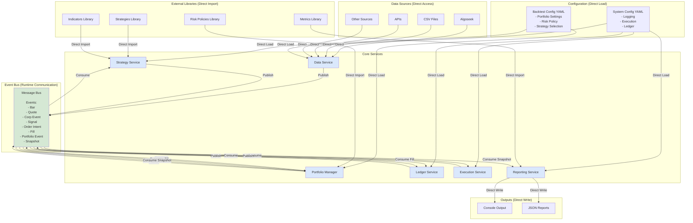
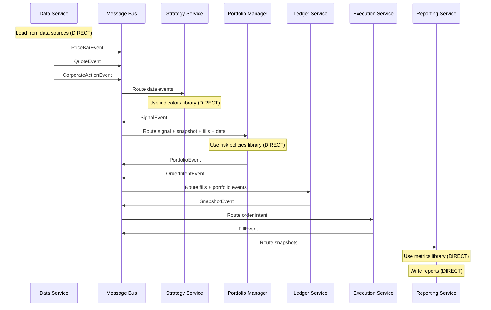

# QTrader High-Level Architecture

**Vision**: Complete system architecture showing both direct connections and event-driven communication

## Key Architectural Principle

**Not everything goes through the Event Bus!**

### Direct Connections (No Event Bus)

- ✅ Configuration files → Services
- ✅ Libraries (strategies, indicators, risk policies) → Services
- ✅ Data sources → Data Service
- ✅ Reports → Output (console, files)

### Event Bus Connections (Runtime Events)

- ✅ Service-to-service communication during backtest
- ✅ Market data events (bars, quotes)
- ✅ Trading events (signals, orders, fills)
- ✅ Portfolio events (snapshots, state updates)

______________________________________________________________________

## Complete System Architecture



______________________________________________________________________

## Detailed Event Flow



______________________________________________________________________

## Service Responsibilities

### Data Service

**Inputs (Direct)**:

- Data sources: Algoseek, CSV, APIs
- System config: data source settings

**Outputs (Event Bus)**:

- `PriceBarEvent` - OHLCV bars
- `QuoteEvent` - Bid/ask quotes
- `CorporateActionEvent` - Splits, dividends
- `EconomicEvent` - Macro data

**Responsibility**: Stream market data from various sources

______________________________________________________________________

### Strategy Service

**Inputs (Direct)**:

- Backtest config: strategy selection & parameters
- Strategies library: external strategy files
- Indicators library: technical indicators

**Inputs (Event Bus)**:

- `PriceBarEvent`, `QuoteEvent` - Market data

**Outputs (Event Bus)**:

- `SignalEvent` - Trading signals

**Responsibility**: Load and execute trading strategies

______________________________________________________________________

### Portfolio Manager

**Inputs (Direct)**:

- Backtest config: portfolio settings, risk policy
- Risk policies library: position sizing, limits

**Inputs (Event Bus)**:

- `SignalEvent` - Trading signals
- `SnapshotEvent` - Ledger snapshots
- `FillEvent` - Execution confirmations
- `PriceBarEvent` - Price updates for valuation

**Outputs (Event Bus)**:

- `PortfolioEvent` - Portfolio state changes
- `OrderIntentEvent` - Orders to execute

**Responsibility**: Manage positions, apply risk policies, generate orders

______________________________________________________________________

### Ledger Service

**Inputs (Direct)**:

- System config: ledger settings

**Inputs (Event Bus)**:

- `FillEvent` - Execution confirmations
- `PortfolioEvent` - Portfolio updates

**Outputs (Event Bus)**:

- `SnapshotEvent` - Portfolio/account snapshots

**Responsibility**: Track account state, transactions, balances

______________________________________________________________________

### Execution Service

**Inputs (Direct)**:

- System config: execution settings (slippage, commission)

**Inputs (Event Bus)**:

- `OrderIntentEvent` - Orders from portfolio manager

**Outputs (Event Bus)**:

- `FillEvent` - Execution confirmations with fill price

**Responsibility**: Simulate order execution with realistic models

______________________________________________________________________

### Reporting Service

**Inputs (Direct)**:

- Metrics library: performance calculations
- System config: reporting settings

**Inputs (Event Bus)**:

- `SnapshotEvent` - Portfolio snapshots
- (Potentially) `JSON` events from ledger

**Outputs (Direct)**:

- Console output
- JSON reports saved to disk

**Responsibility**: Generate performance reports and analytics

______________________________________________________________________

## Why This Separation?

### Event Bus is for Runtime Communication

- **Dynamic**: Events occur during backtest execution
- **Asynchronous**: Services don't need to know about each other
- **Decoupled**: Easy to add/remove services
- **Testable**: Can mock events for testing

### Direct Connections are for Static Resources

- **Configuration**: Loaded once at startup
- **Libraries**: Imported as Python modules
- **Data Sources**: Direct API/file access is simpler
- **Outputs**: Writing files doesn't need event bus overhead

### Benefits

1. **Simpler**: No unnecessary event bus overhead
1. **Faster**: Direct imports/loads are faster than events
1. **Clearer**: Separation of concerns is obvious
1. **Maintainable**: Easy to understand data flow

______________________________________________________________________

## Comparison with Current Implementation

### What We Have Now (Phase 5)

```
DataService → EventBus → All Services
                ↓
         (Phase-based ordering)
```

### What We're Moving Toward (Your Vision)

```
Config/Libraries → Services (DIRECT)
         +
Services ↔ EventBus ↔ Services (RUNTIME)
         +
Services → Outputs (DIRECT)
```

### Key Changes Needed

1. **Separate Configuration Loading**

   - System config: execution, ledger, logging settings
   - Backtest config: strategy, portfolio, risk settings
   - Load configs BEFORE services start, not via events

1. **Direct Library Access**

   - Strategies: Import `.py` files directly
   - Indicators: Use as Python modules
   - Risk policies: Import risk policy classes
   - Metrics: Import calculation functions

1. **Keep Event Bus for Runtime**

   - Market data events (bars, quotes)
   - Trading events (signals, orders, fills)
   - Portfolio events (snapshots, state updates)
   - This is what we have now - it's correct!

1. **Direct Output**

   - Console printing (no event needed)
   - File writing (no event needed)
   - JSON serialization (direct write)

______________________________________________________________________

## Mapping to Current Implementation ✅

**Your vision already matches the current implementation!** Just different naming:

| Your Diagram          | Current Code         | Responsibility                                                         |
| --------------------- | -------------------- | ---------------------------------------------------------------------- |
| **Portfolio Manager** | **RiskService**      | Risk policies, position sizing, order approval (WHAT to trade)         |
| **Ledger Service**    | **PortfolioService** | Position tracking, accounting, P&L, snapshots (truth of account state) |

### Why This Separation is Brilliant

1. **Portfolio Manager (RiskService)** - The Decision Maker

   - ✅ Receives signals from strategies
   - ✅ Applies risk policies (concentration, leverage, cash buffer)
   - ✅ Sizes positions based on capital allocation
   - ✅ Generates Order Intent (orders to execute)
   - ✅ Uses ledger snapshots for risk calculations
   - **Focus**: Trading decisions and risk management

1. **Ledger Service (PortfolioService)** - The Accountant

   - ✅ Receives fills from execution
   - ✅ Updates positions and cash
   - ✅ Tracks transaction history (lot tracking)
   - ✅ Publishes portfolio snapshots
   - ✅ Source of truth for account state
   - **Focus**: Bookkeeping and record-keeping

### Benefits of This Architecture

- **Testability**: Can test risk logic without accounting complexity
- **Modularity**: Can swap risk policies without touching ledger
- **Clarity**: Trading decisions vs bookkeeping are completely separate
- **Reconciliation**: Ledger is clean accounting layer
- **Single Responsibility**: Each service has one clear purpose

______________________________________________________________________

## Discussion Points

### 1. Order Intent vs OrderApprovedEvent - Better Naming? ✅

Your diagram uses "Order Intent" instead of "OrderApprovedEvent". This is more intuitive:

- **Order Intent**: Portfolio Manager's instruction of WHAT to trade
- **OrderApproved**: Implementation detail (approved by risk checks)

**Suggestion**: Rename `OrderApprovedEvent` → `OrderIntentEvent` for clarity?

### 2. Economic Events - Future Enhancement 🔮

Your diagram includes "Economic Event" from Data Service:

- Not just price data
- Macro events (Fed decisions, unemployment, GDP, etc.)
- Strategies could use fundamental data

**Question**: Should we design DataService to support this from the start?

### 3. Reporting Service - Next Priority 🎯

Your diagram shows proper Reporting Service:

- Consumes snapshots from Ledger (PortfolioService)
- Uses Metrics Library (direct import for performance calculations)
- Outputs to Console and JSON (direct write)

**Status**: We don't have this yet! Good candidate for Phase 6.

______________________________________________________________________

## Next Steps - Refinement Priorities

1. **✅ Architecture Alignment**: Current implementation already matches your vision!

   - RiskService = Portfolio Manager ✅
   - PortfolioService = Ledger ✅
   - Event bus for runtime, direct for config/libraries ✅

1. **Naming Cleanup** (Optional):

   - Rename `OrderApprovedEvent` → `OrderIntentEvent`?
   - Add comments clarifying RiskService = "Portfolio Manager" role?

1. **Reporting Service** (Phase 6 - Missing):

   - Consume portfolio snapshots
   - Calculate metrics (Sharpe, drawdown, etc.)
   - Output console reports and JSON
   - Direct library imports for metrics

1. **Economic Events** (Future):

   - Extend DataService for fundamental data
   - Add `EconomicEvent` type
   - Allow strategies to consume macro data

Your high-level view perfectly captures the **mature architecture** we should aim for! The current implementation is already 80% there - we just need to add Reporting Service and clarify naming.
