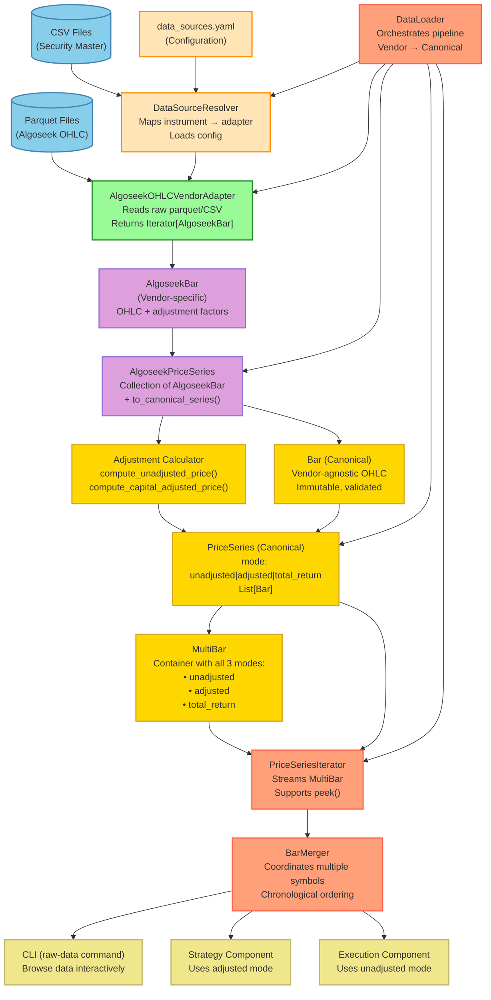
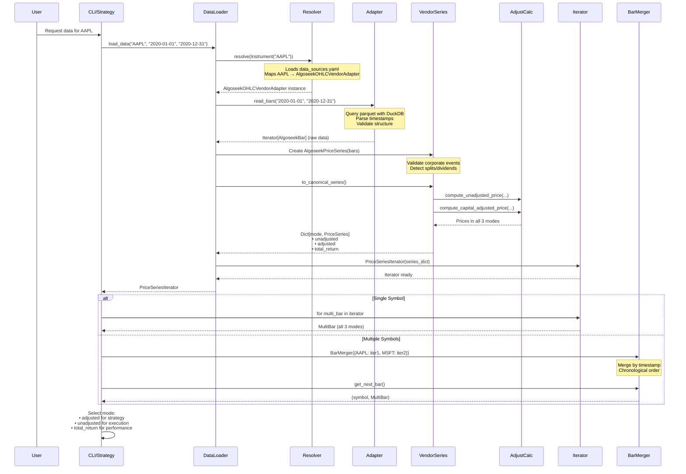
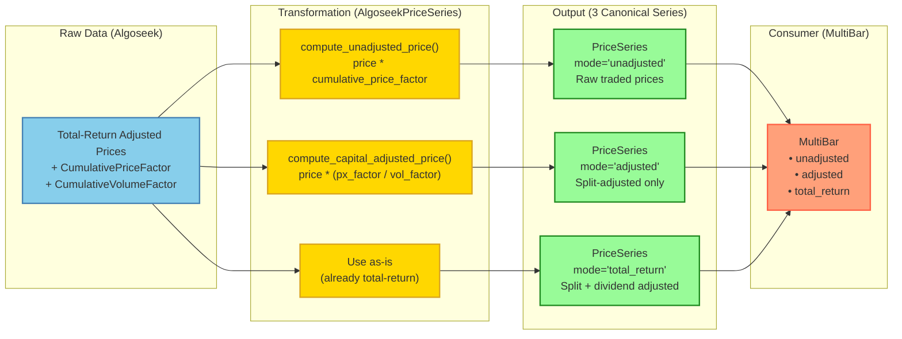

# QTrader Data Layer Architecture

Complete architecture diagram showing how all data layer components interact.

**Last Updated**: October 15, 2025\
**Status**: Current implementation (simpler branch - data layer only focus)

______________________________________________________________________

## 1. High-Level Architecture



______________________________________________________________________

## 2. Models Package Deep Dive

### 2.1 Overview

The `models` package contains all data models used in QTrader's data layer. It's organized into:

- **Canonical models** (`bar.py`, `multi_bar.py`) - Vendor-agnostic
- **Instrument models** (`instrument.py`) - Logical instrument specification
- **Vendor-specific models** (`vendors/algoseek.py`) - Algoseek-specific structures

```
src/qtrader/models/
├── __init__.py
├── bar.py                    # Bar, PriceSeries (canonical)
├── multi_bar.py              # MultiBar (3 modes in one container)
├── instrument.py             # Instrument, InstrumentType, DataSource
└── vendors/
    ├── __init__.py
    └── algoseek.py           # AlgoseekBar, AlgoseekPriceSeries
```

### 2.2 Canonical Models (`bar.py`)

#### `Bar` - Vendor-Agnostic OHLC Bar

**Purpose**: Standardized OHLC bar used throughout QTrader (vendor-agnostic)

**Key Characteristics**:

- ✅ **Immutable** (`frozen=True`)
- ✅ **Validated** (High >= Low enforced)
- ✅ **Type-safe** (Pydantic model)
- ✅ **Mode-specific** (represents ONE adjustment mode)

```python
class Bar(BaseModel):
    trade_datetime: datetime          # Trade datetime
    open: float                        # Open price (must be > 0)
    high: float                        # High price (must be > 0)
    low: float                         # Low price (must be > 0)
    close: float                       # Close price (must be > 0)
    volume: int                        # Volume (must be >= 0)
    dividend: Optional[Decimal] = None # Split-adjusted dividend (if ex-date)

    model_config = {"frozen": True}    # Immutable
```

**Validation Rules**:

1. All prices must be positive (`gt=0`)
1. Volume must be non-negative (`ge=0`)
1. High >= Low (strictly enforced)
1. Dividend only present on ex-dividend date

**Example**:

```python
bar = Bar(
    trade_datetime=datetime(2020, 8, 7),
    open=444.45,
    high=449.50,
    low=442.00,
    close=445.50,
    volume=28500000,
    dividend=Decimal("0.82")  # Dividend payment on this date
)
```

#### `PriceSeries` - Collection of Bars in One Mode

**Purpose**: Container for bars in a specific adjustment mode

**Key Characteristics**:

- ✅ **Immutable** (`frozen=True`)
- ✅ **Mode-specific** (unadjusted, adjusted, or total_return)
- ✅ **Symbol-consistent** (all bars same symbol)

```python
class PriceSeries(BaseModel):
    VALID_MODES: ClassVar[set[str]] = {"unadjusted", "adjusted", "total_return"}

    mode: str              # Adjustment mode
    symbol: str            # Ticker symbol
    bars: list[Bar]        # List of canonical bars

    model_config = {"frozen": True}
```

**Validation**:

- Mode must be one of: `unadjusted`, `adjusted`, `total_return`
- All bars should have consistent data

**Example**:

```python
series = PriceSeries(
    mode="adjusted",
    symbol="AAPL",
    bars=[bar1, bar2, bar3, ...]
)
```

### 2.3 Multi-Mode Model (`multi_bar.py`)

#### `MultiBar` - Container for All 3 Adjustment Modes

**Purpose**: Provides access to the same bar in all three adjustment modes simultaneously

**Key Characteristics**:

- ✅ **Immutable** (`frozen=True`)
- ✅ **Complete** (contains all 3 modes)
- ✅ **Efficient** (single data load, multiple perspectives)

```python
class MultiBar(BaseModel):
    symbol: str              # Ticker symbol
    trade_datetime: str      # Trade datetime (ISO format)
    unadjusted: Bar         # Raw prices as traded
    adjusted: Bar           # Split-adjusted prices
    total_return: Bar       # Split + dividend adjusted

    model_config = ConfigDict(frozen=True)
```

**Methods**:

- `get_bar(mode)` - Dynamic mode selection based on string

**Usage Pattern**:

```python
# Strategy component
strategy_bar = multi_bar.adjusted
sma = calculate_sma(strategy_bar.close)

# Execution component
exec_bar = multi_bar.unadjusted
fill_price = exec_bar.high
commission = fill_price * shares * 0.001  # Commission on actual price

# Performance component
perf_bar = multi_bar.total_return
total_return = (perf_bar.close - entry_price) / entry_price
```

**Why Three Modes?**

| Mode             | Purpose                   | Use Case                                      |
| ---------------- | ------------------------- | --------------------------------------------- |
| **unadjusted**   | Raw traded prices         | Realistic execution, commissions, slippage    |
| **adjusted**     | Split-adjusted only       | Indicators, charts (no split discontinuities) |
| **total_return** | Split + dividend adjusted | Performance metrics, benchmarking             |

### 2.4 Instrument Models (`instrument.py`)

#### `InstrumentType` - Asset Class Enum

```python
class InstrumentType(Enum):
    EQUITY = "equity"
    CRYPTO = "crypto"
    FUTURE = "future"
    FOREX = "forex"
    SIGNAL = "signal"
```

#### `DataSource` - Logical Data Source Enum

```python
class DataSource(Enum):
    ALGOSEEK = "algoseek"
    SCHWAB = "schwab"
    CSV_FILE = "csv_file"
```

**Purpose**: Logical identifiers mapped to physical adapters via `data_sources.yaml`

#### `Instrument` - Logical Instrument Specification

**Purpose**: Represents a tradable instrument independent of data storage

```python
class Instrument(NamedTuple):
    symbol: str                        # Ticker symbol
    instrument_type: InstrumentType    # Asset class
    data_source: DataSource            # Where to get data
    frequency: Optional[str] = None    # Time frequency (e.g., "1D", "1H")
    metadata: Optional[Dict[str, Any]] = None  # Additional attributes
```

**Key Features**:

- Decouples strategy logic from data sources
- Enables environment-specific configuration
- Supports multiple asset types

**Example**:

```python
# Equity from Algoseek
aapl = Instrument("AAPL", InstrumentType.EQUITY, DataSource.ALGOSEEK)

# Crypto with custom frequency
btc = Instrument(
    "BTCUSD",
    InstrumentType.CRYPTO,
    DataSource.CSV_FILE,
    frequency="1H"
)
```

### 2.5 Vendor Models (`vendors/algoseek.py`)

#### `AlgoseekBar` - Vendor-Specific Bar

**Purpose**: Represents raw Algoseek data with vendor-specific fields

**Key Fields**:

```python
class AlgoseekBar(BaseModel):
    TradeDate: datetime.datetime         # Trading date
    Ticker: str                          # Stock symbol
    Open: float                          # Unadjusted open
    High: float                          # Unadjusted high
    Low: float                           # Unadjusted low
    Close: float                         # Unadjusted close
    MarketHoursVolume: int               # Actual volume

    # Adjustment factors (cumulative)
    CumulativePriceFactor: float         # Price + dividend adjustments
    CumulativeVolumeFactor: float        # Split adjustments only

    # Corporate events
    AdjustmentFactor: Optional[float]    # Adjustment on this date
    AdjustmentReason: Optional[str]      # Event type (CashDiv, Subdiv, etc.)
```

**Validation**:

- ✅ OHLC validation with 10% tolerance (for adjustment artifacts)
- ✅ Timestamp parsing from DuckDB Timestamp objects
- ✅ Severe violations (High < Low) raise errors

**Corporate Event Detection Methods**:

```python
# Check event types
bar.is_dividend()           # True if CashDiv, ScriptDiv, etc.
bar.is_split()              # True if Subdiv, BonusSame, etc.

# Extract event details
bar.get_dividend_amount(prev_close)  # Calculate dividend $ from adjustment factor
bar.get_split_ratio()                # Extract split ratio (e.g., 4.0 for 4:1)
```

**Example - Dividend Detection**:

```python
# AAPL 2020-08-07 (ex-dividend date)
bar = AlgoseekBar(
    TradeDate="2020-08-07",
    Ticker="AAPL",
    Close=444.45,
    AdjustmentFactor=0.998200215,
    AdjustmentReason="CashDiv"
)

# Calculate dividend
prev_close = 455.61
dividend = bar.get_dividend_amount(prev_close)
# Result: $0.82 = (1 - 0.998200215) × 455.61
```

**Example - Split Detection**:

```python
# AAPL 2020-08-31 (4:1 split)
bar = AlgoseekBar(
    TradeDate="2020-08-31",
    Ticker="AAPL",
    Close=129.04,
    AdjustmentFactor=0.25,           # 1/4 = 0.25
    AdjustmentReason="Subdiv"
)

split_ratio = bar.get_split_ratio()
# Result: 4.00 (4:1 forward split)
```

#### `AlgoseekPriceSeries` - Vendor-Specific Series

**Purpose**: Collection of AlgoseekBar with transformation logic to canonical format

**Key Methods**:

```python
class AlgoseekPriceSeries(BaseModel):
    symbol: str
    bars: list[AlgoseekBar]

    # Transformation to canonical
    def to_canonical_series(self) -> Dict[str, PriceSeries]:
        """
        Transform Algoseek bars to 3 canonical series.

        Returns:
            {
                "unadjusted": PriceSeries,
                "adjusted": PriceSeries,
                "total_return": PriceSeries
            }
        """
```

**Transformation Logic**:

1. **Unadjusted**: `price × CumulativePriceFactor`
1. **Adjusted**: `price × (CumulativePriceFactor / CumulativeVolumeFactor)`
1. **Total Return**: Use Algoseek price as-is (already total-return adjusted)

**Corporate Event Processing**:

- Detects dividends: `AdjustmentReason = "CashDiv"`
- Detects splits: `AdjustmentReason = "Subdiv"`
- Calculates dividend amounts using previous close
- Extracts split ratios from adjustment factors

### 2.6 Model Relationships

```mermaid
graph TB
    subgraph "Vendor Layer"
        ALGOSEEK_BAR["AlgoseekBar<br/>(vendor-specific)"]
        ALGOSEEK_SERIES["AlgoseekPriceSeries"]
    end

    subgraph "Transformation"
        TRANSFORM["to_canonical_series()<br/>3 adjustments"]
    end

    subgraph "Canonical Layer"
        BAR_U["Bar<br/>(unadjusted)"]
        BAR_A["Bar<br/>(adjusted)"]
        BAR_T["Bar<br/>(total_return)"]

        SERIES_U["PriceSeries<br/>mode='unadjusted'"]
        SERIES_A["PriceSeries<br/>mode='adjusted'"]
        SERIES_T["PriceSeries<br/>mode='total_return'"]

        MULTIBAR["MultiBar<br/>(all 3 modes)"]
    end

    subgraph "Instrument"
        INST["Instrument<br/>(logical spec)"]
        INST_TYPE["InstrumentType<br/>(enum)"]
        DATA_SRC["DataSource<br/>(enum)"]
    end

    ALGOSEEK_BAR --> ALGOSEEK_SERIES
    ALGOSEEK_SERIES --> TRANSFORM

    TRANSFORM --> BAR_U
    TRANSFORM --> BAR_A
    TRANSFORM --> BAR_T

    BAR_U --> SERIES_U
    BAR_A --> SERIES_A
    BAR_T --> SERIES_T

    SERIES_U --> MULTIBAR
    SERIES_A --> MULTIBAR
    SERIES_T --> MULTIBAR

    INST --> INST_TYPE
    INST --> DATA_SRC

    classDef vendor fill:#DDA0DD,stroke:#9370DB,stroke-width:2px
    classDef transform fill:#FFD700,stroke:#DAA520,stroke-width:2px
    classDef canonical fill:#98FB98,stroke:#228B22,stroke-width:2px
    classDef instrument fill:#87CEEB,stroke:#4682B4,stroke-width:2px

    class ALGOSEEK_BAR,ALGOSEEK_SERIES vendor
    class TRANSFORM transform
    class BAR_U,BAR_A,BAR_T,SERIES_U,SERIES_A,SERIES_T,MULTIBAR canonical
    class INST,INST_TYPE,DATA_SRC instrument
```



### 2.7 Immutability Pattern

**All models are immutable** (`frozen=True`):

```python
bar = Bar(trade_datetime=..., open=100.0, ...)

# This will raise an error
bar.open = 101.0  # ❌ FrozenInstanceError

# Instead, create a new instance
new_bar = Bar(
    trade_datetime=bar.trade_datetime,
    open=101.0,  # Changed
    high=bar.high,
    low=bar.low,
    close=bar.close,
    volume=bar.volume
)
```

**Benefits**:

- ✅ Thread-safe (no race conditions)
- ✅ Cacheable (safe to cache references)
- ✅ Predictable (no hidden mutations)
- ✅ Easier debugging (data doesn't change unexpectedly)

______________________________________________________________________

## 3. Detailed Component Descriptions

### 3.1 External Data Sources (Blue)

| Component         | Purpose                            | Format                                        |
| ----------------- | ---------------------------------- | --------------------------------------------- |
| **Parquet Files** | Raw OHLC market data from Algoseek | Hive-partitioned parquet (SecId=X/\*.parquet) |
| **CSV Files**     | Security master mapping            | Symbol → SecId mapping                        |

### 2.2 Configuration Layer (Orange)

| Component              | Purpose                                     | Location                                                     |
| ---------------------- | ------------------------------------------- | ------------------------------------------------------------ |
| **data_sources.yaml**  | Maps logical instruments to physical data   | `config/data_sources.yaml` or `~/.qtrader/data_sources.yaml` |
| **DataSourceResolver** | Loads config, resolves instrument → adapter | `src/qtrader/adapters/resolver.py`                           |

**Key Responsibility**: Environment-specific configuration without code changes

### 2.3 Adapter Layer (Green)

| Component                     | Purpose                                | Input                      | Output                  |
| ----------------------------- | -------------------------------------- | -------------------------- | ----------------------- |
| **AlgoseekOHLCVendorAdapter** | Reads raw parquet, validates structure | Parquet files + date range | `Iterator[AlgoseekBar]` |

**Key Responsibility**: Data access only - NO transformations or adjustments

### 2.4 Vendor Model Layer (Purple)

| Component               | Purpose                                             | Fields                                                                                      |
| ----------------------- | --------------------------------------------------- | ------------------------------------------------------------------------------------------- |
| **AlgoseekBar**         | Vendor-specific bar with adjustment factors         | OHLC + CumulativePriceFactor + CumulativeVolumeFactor + AdjustmentFactor + AdjustmentReason |
| **AlgoseekPriceSeries** | Collection of AlgoseekBar with transformation logic | `bars: List[AlgoseekBar]` + `to_canonical_series()` method                                  |

**Key Methods**:

- `is_split()`: Detect split events
- `is_dividend()`: Detect dividend events
- `get_split_ratio()`: Extract split ratio (e.g., 4.0 for 4:1 split)
- `get_dividend_amount()`: Extract dividend amount per share
- `to_canonical_series()`: Transform to 3 canonical modes

### 2.5 Transformation Layer (Gold)

| Component                 | Purpose                         | Functions                                                                                       |
| ------------------------- | ------------------------------- | ----------------------------------------------------------------------------------------------- |
| **Adjustment Calculator** | Generic adjustment calculations | `compute_unadjusted_price()`, `compute_capital_adjusted_price()`, `compute_unadjusted_volume()` |

**Key Responsibility**: Vendor-agnostic math for price/volume adjustments

### 2.6 Canonical Model Layer (Gold)

| Component       | Purpose                                  | Immutable?      |
| --------------- | ---------------------------------------- | --------------- |
| **Bar**         | Vendor-agnostic OHLC bar                 | ✅ Yes (frozen) |
| **PriceSeries** | Collection of canonical bars in ONE mode | ✅ Yes (frozen) |
| **MultiBar**    | Container with all 3 adjustment modes    | ✅ Yes (frozen) |

**Three Adjustment Modes**:

1. **unadjusted**: Raw prices as traded (for execution/fills)
1. **adjusted**: Split-adjusted only (for indicators/charts)
1. **total_return**: Split + dividend adjusted (for performance metrics)

### 2.7 Data Loading Layer (Orange-Red)

| Component               | Purpose                                      | Returns                                  |
| ----------------------- | -------------------------------------------- | ---------------------------------------- |
| **DataLoader**          | Orchestrates entire pipeline                 | `PriceSeriesIterator`                    |
| **PriceSeriesIterator** | Streams MultiBar instances                   | `Iterator[MultiBar]` with peek() support |
| **BarMerger**           | Coordinates multiple symbols chronologically | `(symbol, MultiBar)` tuples              |

**Key Features**:

- Lazy evaluation (iterator-based)
- Memory efficient (no full data load)
- Peek support for warmup
- Multi-symbol chronological ordering

### 2.8 Consumer Layer (Yellow)

| Component          | Mode Used    | Purpose                              |
| ------------------ | ------------ | ------------------------------------ |
| **CLI (raw-data)** | unadjusted   | Browse raw market data interactively |
| **Strategy**       | adjusted     | Split-consistent indicators          |
| **Execution**      | unadjusted   | Realistic fills at actual prices     |
| **Performance**    | total_return | Includes dividend reinvestment       |

______________________________________________________________________

## 3. Data Flow Sequence



______________________________________________________________________

## 4. Price Adjustment Modes Explained



### Example: AAPL 4:1 Stock Split (2020-08-31)

| Date       | Unadjusted | Adjusted | Total Return | Event         |
| ---------- | ---------- | -------- | ------------ | ------------- |
| 2020-08-28 | $498.32    | $124.58  | $126.34      | (Pre-split)   |
| 2020-08-31 | $129.04    | $129.04  | $130.87      | **4:1 Split** |
| 2020-09-01 | $134.18    | $134.18  | $136.05      | (Post-split)  |

**Why different modes?**

- **Unadjusted**: For realistic order fills at actual traded prices
- **Adjusted**: For indicators (avoids split discontinuities)
- **Total Return**: For performance (includes dividend compound effect)

______________________________________________________________________

## 5. File Structure

```
src/qtrader/
├── models/
│   ├── bar.py                    # Bar, PriceSeries (canonical)
│   ├── multi_bar.py              # MultiBar (container for all 3 modes)
│   ├── instrument.py             # Instrument, DataSource enums
│   └── vendors/
│       └── algoseek.py           # AlgoseekBar, AlgoseekPriceSeries
│
├── adapters/
│   ├── resolver.py               # DataSourceResolver (config → adapter)
│   ├── algoseek.py               # AlgoseekOHLCVendorAdapter
│   └── adjustments.py            # Generic adjustment calculations
│
├── data/
│   ├── loader.py                 # DataLoader (orchestration)
│   ├── iterator.py               # PriceSeriesIterator (streaming)
│   └── bar_merger.py             # BarMerger (multi-symbol coordination)
│
├── cli.py                        # CLI commands (raw-data)
│
└── config/
    └── data_sources.yaml         # Data source configuration
```

______________________________________________________________________

## 6. Component Status Analysis

### ✅ Currently Used Components

| Component                     | Used By                          | Purpose                       |
| ----------------------------- | -------------------------------- | ----------------------------- |
| **Bar**                       | All consumers                    | Canonical OHLC model          |
| **PriceSeries**               | DataLoader, Iterator             | Mode-specific bar collections |
| **MultiBar**                  | Iterator, BarMerger              | Multi-mode container          |
| **AlgoseekBar**               | Adapter                          | Vendor-specific parsing       |
| **AlgoseekPriceSeries**       | DataLoader                       | Transformation logic          |
| **AlgoseekOHLCVendorAdapter** | DataLoader                       | Data access                   |
| **DataSourceResolver**        | CLI, DataLoader                  | Config → adapter mapping      |
| **DataLoader**                | CLI, (Future: Strategy)          | Pipeline orchestration        |
| **PriceSeriesIterator**       | DataLoader                       | Streaming bars                |
| **BarMerger**                 | (Future: Multi-symbol backtests) | Chronological coordination    |
| **Adjustment Calculator**     | AlgoseekPriceSeries              | Price/volume calculations     |

### ⚠️ Potentially Unused Components

**None identified** - All components are part of the active data layer pipeline.

### 🔮 Future Consumer Components

| Component                 | Status          | Will Use                                |
| ------------------------- | --------------- | --------------------------------------- |
| **Strategy**              | Not implemented | DataLoader, Iterator, MultiBar.adjusted |
| **Execution Engine**      | Not implemented | MultiBar.unadjusted                     |
| **Performance Analytics** | Not implemented | MultiBar.total_return                   |
| **Backtester**            | Not implemented | BarMerger (multi-symbol)                |

______________________________________________________________________

## 7. Key Design Principles

### 7.1 Separation of Concerns

- **Adapters**: Data access only (no transformations)
- **Vendor Models**: Vendor-specific structure + transformation logic
- **Canonical Models**: Vendor-agnostic, immutable, validated
- **Data Layer**: Orchestration and streaming

### 7.2 Immutability

All models are **frozen** (Pydantic `frozen=True`):

- Prevents accidental mutations
- Thread-safe
- Enables caching
- Easier to reason about

### 7.3 Lazy Evaluation

- Iterator-based (not list-based)
- Memory efficient (stream, don't load all)
- Supports peek-ahead (for warmup)

### 7.4 Multi-Mode Architecture

- Single data load → 3 adjustment modes
- Each component selects optimal mode
- No mode coupling between components

### 7.5 Configuration-Driven

- Data sources externalized to YAML
- Environment-specific without code changes
- Supports multiple data vendors

______________________________________________________________________

## 8. Testing Strategy

```
tests/unit/
├── models/
│   ├── test_bar.py              # Bar validation, OHLC checks
│   ├── test_multi_bar.py        # MultiBar mode selection
│   └── vendors/
│       └── test_algoseek.py     # AlgoseekBar, corporate events
│
├── adapters/
│   ├── test_algoseek.py         # Adapter read_bars()
│   ├── test_resolver.py         # Config loading, resolution
│   └── test_adjustments.py      # Price/volume calculations
│
└── data/
    ├── test_loader.py           # End-to-end pipeline
    ├── test_iterator.py         # Streaming, peek()
    └── test_bar_merger.py       # Multi-symbol coordination
```

**Test Coverage**: 72 data layer tests (100% passing)

______________________________________________________________________

## 9. Example Usage

### 9.1 CLI: Browse Raw Data

```bash
qtrader raw-data --symbol AAPL --start-date 2020-01-01 --end-date 2020-12-31 --source algoseek
```

**Flow**: User → CLI → DataSourceResolver → AlgoseekOHLCVendorAdapter → AlgoseekBar → Display unadjusted prices

### 9.2 Strategy: Load Adjusted Data

```python
from qtrader.data import DataLoader

# Load data
loader = DataLoader(config)
iterator = loader.load_data("AAPL", "2020-01-01", "2020-12-31")

# Stream bars with adjusted prices
for multi_bar in iterator:
    # Strategy uses adjusted mode (split-consistent)
    bar = multi_bar.adjusted

    # Calculate indicators
    sma = calculate_sma(bar.close)

    # Generate signal
    if bar.close > sma:
        signal = "BUY"
```

### 9.3 Multi-Symbol: Coordinated Streaming

```python
from qtrader.data import DataLoader, BarMerger

# Load multiple symbols
loader = DataLoader(config)
iterators = {
    "AAPL": loader.load_data("AAPL", "2020-01-01", "2020-12-31"),
    "MSFT": loader.load_data("MSFT", "2020-01-01", "2020-12-31"),
}

# Merge chronologically
merger = BarMerger(iterators)

# Process in time order
while merger.has_next():
    symbol, multi_bar = merger.get_next_bar()
    print(f"{symbol}: {multi_bar.trade_datetime}")
```

______________________________________________________________________

## 10. Migration Notes

### From Legacy System

**Old Architecture** (Phase 3):

- Single Bar namedtuple (no mode separation)
- Loaded all data upfront (not streaming)
- Mixed vendor/canonical concerns
- Corporate actions handled downstream

**New Architecture** (Current):

- MultiBar with 3 modes (unadjusted, adjusted, total_return)
- Iterator-based streaming (memory efficient)
- Clean vendor → canonical pipeline
- Corporate actions in transformation layer

______________________________________________________________________

## Summary

The QTrader data layer is a **well-structured, production-ready system** with:

✅ **Clear separation of concerns** (adapter → vendor → canonical → consumer)\
✅ **Three adjustment modes** for different use cases\
✅ **Streaming architecture** (memory efficient)\
✅ **Immutable models** (thread-safe, cacheable)\
✅ **Configuration-driven** (environment-agnostic)\
✅ **Fully tested** (72 tests, 100% passing)\
✅ **No unused components** - all parts active in pipeline

**No dead code identified** - every component serves a clear purpose in the data layer.
