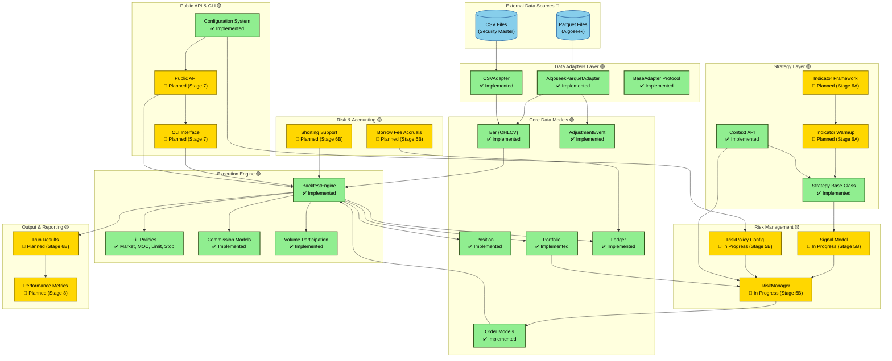
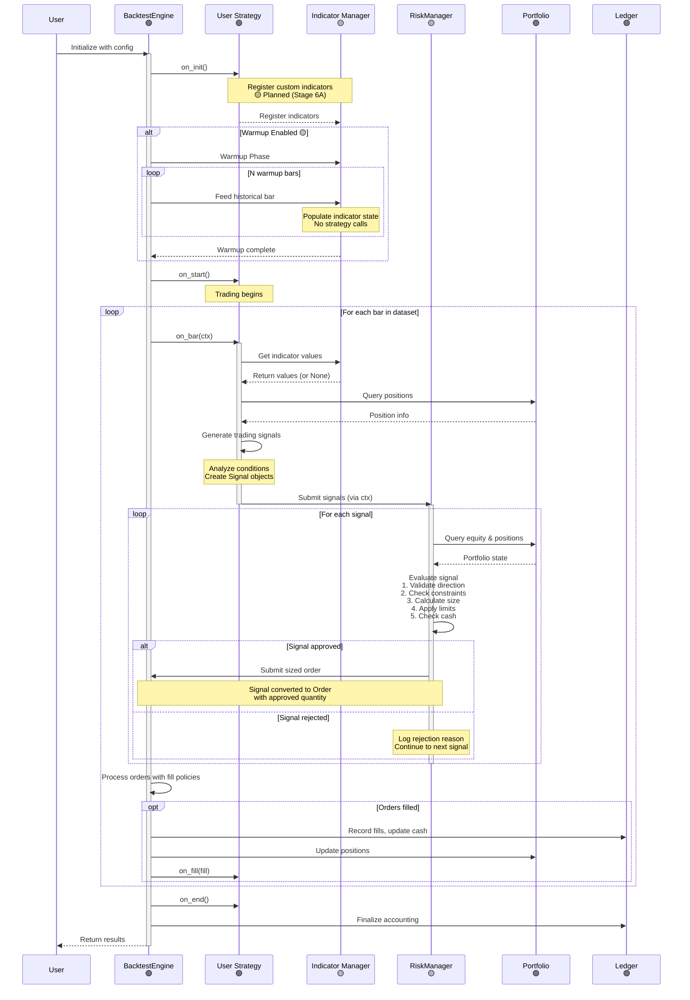
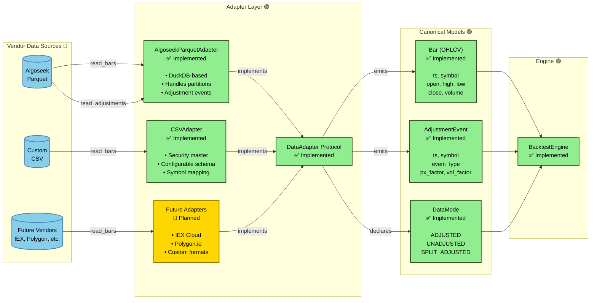
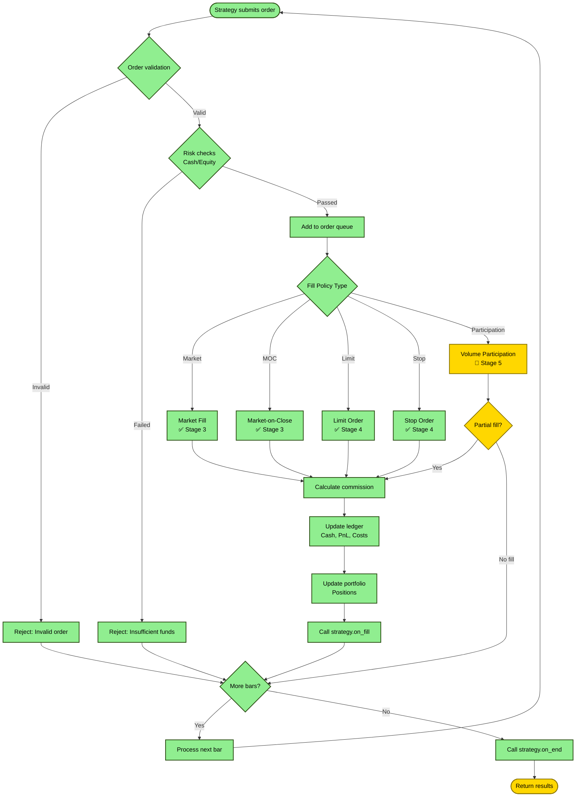
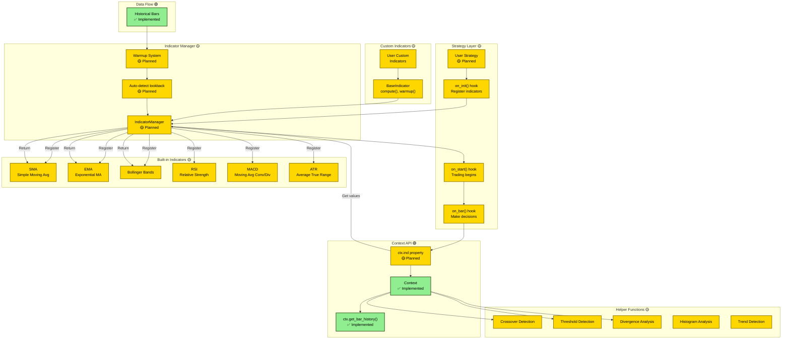
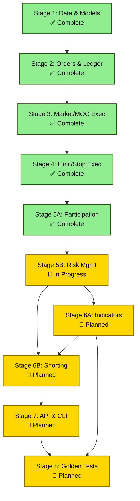

# QTrader Architecture Diagrams

This document provides high-level architecture diagrams for the QTrader backtesting engine.

**Legend:**

- 🟢 Green: Implemented components (Stages 1-5A complete)
- 🟡 Yellow: In progress or planned (Stage 5B-8)
- 🔵 Blue: External dependencies or data sources

## System Architecture Overview



## Event Loop Architecture



## Risk Management Flow (Stage 5B - In Progress)

```mermaid
sequenceDiagram
    participant Strategy as User Strategy<br/>🟢
    participant Context as Context API<br/>🟢
    participant RiskMgr as RiskManager<br/>🟡
    participant Policy as RiskPolicy<br/>🟡
    participant Portfolio as Portfolio<br/>🟢
    participant Engine as ExecutionEngine<br/>🟢

    Note over Strategy: Generate trading intent

    Strategy->>Strategy: Analyze market conditions
    activate Strategy

    Strategy->>Context: Return List[Signal]
    Note over Strategy,Context: Signal = intent (what to trade)<br/>NOT sized order (how much)
    deactivate Strategy

    loop For each Signal
        Context->>RiskMgr: evaluate_signal(signal, current_price)
        activate RiskMgr

        RiskMgr->>Policy: Check allow_shorting
        Policy-->>RiskMgr: Policy rules

        RiskMgr->>Portfolio: Query current positions
        Portfolio-->>RiskMgr: Position state

        RiskMgr->>Portfolio: Query equity & cash
        Portfolio-->>RiskMgr: Financial state

        RiskMgr->>RiskMgr: 1. Validate direction
        RiskMgr->>RiskMgr: 2. Check portfolio constraints
        RiskMgr->>RiskMgr: 3. Calculate size (sizing_method)
        RiskMgr->>RiskMgr: 4. Apply concentration limits
        RiskMgr->>RiskMgr: 5. Check cash availability

        alt Signal Approved
            RiskMgr-->>Context: RiskDecision(approved=True, sized_qty=X)
            deactivate RiskMgr

            Context->>RiskMgr: signal_to_order(signal, decision)
            activate RiskMgr
            RiskMgr-->>Context: Sized Order
            deactivate RiskMgr

            Context->>Engine: submit_order(order)
            Note over Engine: Order enters execution queue

        else Signal Rejected
            RiskMgr-->>Context: RiskDecision(approved=False, reason=X)
            deactivate RiskMgr
            Note over Context: Log rejection, continue
        end
    end

    Note over Engine: Process fills (existing flow)
```

## Data Adapter Architecture



## Order Execution Flow



## Indicator Framework Architecture (Planned - Stage 6A)



## Implementation Progress

### ✅ Completed (Stages 1-5A)

| Component                      | Stage | Status                      |
| ------------------------------ | ----- | --------------------------- |
| **Data Models**                | 1     | ✅ Complete                 |
| - Bar (OHLCV)                  | 1     | ✅ 8/8 tests passing        |
| - Data Adapters                | 1     | ✅ Algoseek Parquet, CSV    |
| - Configuration                | 1     | ✅ YAML-based config        |
| **Order & Ledger**             | 2     | ✅ Complete                 |
| - Order Models                 | 2     | ✅ Market, Limit, Stop, MOC |
| - Portfolio                    | 2     | ✅ Position tracking        |
| - Ledger                       | 2     | ✅ Cash, PnL, costs         |
| **Execution Engine**           | 3-4   | ✅ Complete                 |
| - Market & MOC fills           | 3     | ✅ Implemented              |
| - Limit & Stop fills           | 4     | ✅ Implemented              |
| - Commission models            | 3-4   | ✅ Per-share + ticket min   |
| **Strategy Base**              | 3-4   | ✅ Complete                 |
| - Strategy protocol            | 3     | ✅ Lifecycle hooks          |
| - Context API                  | 3     | ✅ Portfolio access         |
| **Volume Participation**       | 5A    | ✅ Complete                 |
| - Participation fills          | 5A    | ✅ Partial fills            |
| - Volume limits                | 5A    | ✅ Max % of bar volume      |
| - Residual queuing             | 5A    | ✅ Multi-bar fills          |
| - High participation guardrail | 5A    | ✅ Safety checks            |

**Total Tests Passing:** 177 tests (36 Stage 1 + 55 Stage 2 + 86 Stages 3-5A)

### 🔄 In Progress (Stage 5B)

| Component                 | Stage | Status                           |
| ------------------------- | ----- | -------------------------------- |
| **Risk Management**       | 5B    | 🔄 In Progress (Days 17-19)      |
| - Signal model            | 5B    | 🔄 Trading intent representation |
| - RiskPolicy config       | 5B    | 🔄 Configuration system          |
| - RiskManager             | 5B    | 🔄 Evaluation & sizing logic     |
| - Position sizing methods | 5B    | 🔄 4 basic methods (Phase 1)     |
| - Concentration limits    | 5B    | 🔄 Max position %, max count     |
| - Leverage constraints    | 5B    | 🔄 Gross/net exposure limits     |
| - Strategy integration    | 5B    | 🔄 Signal-based workflow         |

**Expected Tests:** 43 tests (35 unit + 8 integration)

### 🔄 Planned (Stages 6A-8)

| Component                | Stage | Status                          |
| ------------------------ | ----- | ------------------------------- |
| **Indicators Framework** | 6A    | 🔄 Planned (Days 20-23)         |
| - Base indicator class   | 6A    | 🔄 compute(), warmup(), reset() |
| - Built-in indicators    | 6A    | 🔄 SMA, EMA, BB, RSI, MACD, ATR |
| - Helper functions       | 6A    | 🔄 13 utility functions         |
| - Warmup system          | 6A    | 🔄 Auto/explicit warmup         |
| - on_init() hook         | 6A    | 🔄 Pre-warmup registration      |
| **Shorting & Accruals**  | 6B    | 🔄 Planned (Days 24-27)         |
| - Short selling          | 6B    | 🔄 Borrow/return logic          |
| - Borrow fees            | 6B    | 🔄 Daily accruals               |
| - Run results            | 6B    | 🔄 JSON/CSV output              |
| **Public API & CLI**     | 7     | 🔄 Planned (Days 28-32)         |
| - Public API             | 7     | 🔄 pip installable              |
| - CLI interface          | 7     | 🔄 qtrader backtest             |
| - Documentation          | 7     | 🔄 API docs, examples           |
| **Golden Baselines**     | 8     | 🔄 Planned (Days 33-37)         |
| - Buy & Hold             | 8     | 🔄 Reference strategy           |
| - SMA Cross              | 8     | 🔄 Indicator validation         |
| - CI Integration         | 8     | 🔄 Automated validation         |

## Component Dependencies



## Notes

- **Green (🟢)**: Fully implemented and tested (Stages 1-5A complete, 177 tests passing)
- **Yellow (🟡)**: Specification complete, implementation in progress or planned (Stage 5B-8)
- **Blue (🔵)**: External dependencies or data sources

The system follows a **ports & adapters** architecture with clear separation between:

1. Data ingestion (adapters normalize vendor formats)
1. Core models (vendor-agnostic Bar contract)
1. Execution engine (deterministic event loop)
1. Strategy layer (user-defined trading logic)
1. Output & reporting (results, metrics, audit trails)

For detailed specifications, see:

- Technical Specification: `docs/specs/phase01.md`
- Implementation Plan: `docs/implementation_plan_phase01.md`
