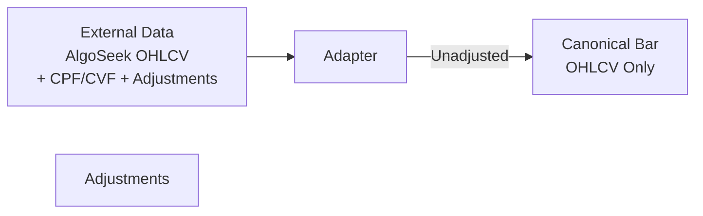
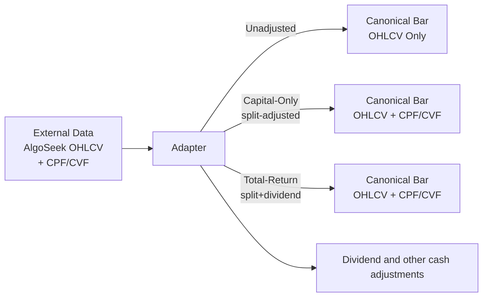

# Canonical Bars from AlgoseekOHLC Dataset

## 1. Current Status

The adapter maps the column name to standard OHLCV fields and provide adjustment factors to be used downstream.

This is forcing bar computations downstream, which is not ideal.

______________________________________________________________________

## 2. What I envision is this model

The adapter transforms external data into canonical bars with different adjustment modes:

- **Unadjusted**: Raw OHLCV data as reported (useful for execution simulation, commissions, slippage)
- **Capital-Only**: Adjusted for splits using the adjustment factor when the adjustment reason is SubDiv (or other affecting only capital, read the dataset documentation in docs). Dividends are not adjusted and added as cash to the portfolio. Uses CPF and CVF.
- **Total-Return**: Adjusted for splits and dividends using both CPF and CVF for strategies with automatic dividends reinvestment
- **Dividend and other cash adjustments**: Provides separate adjustment events for dividends and corporate actions

Downstream components can then choose the appropriate bar type for their needs, simplifying logic and improving clarity.
